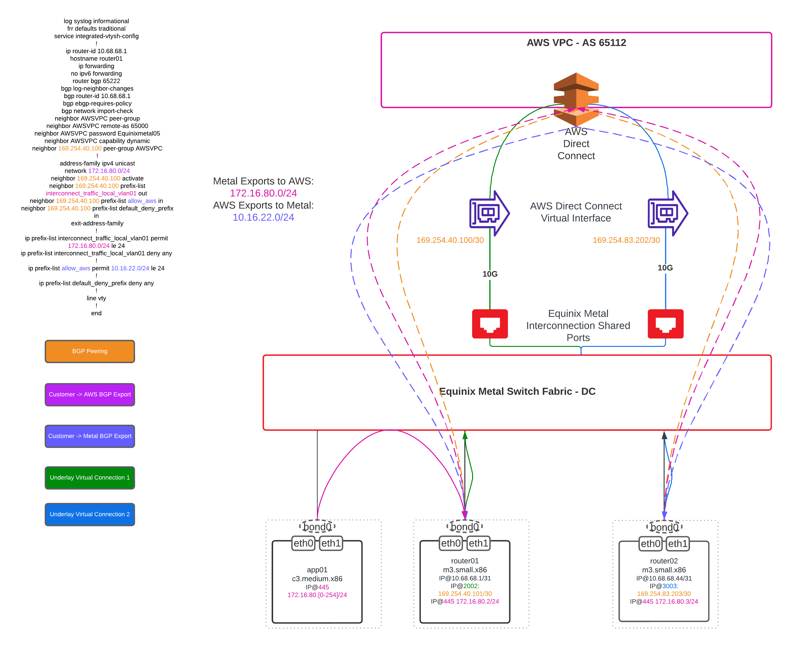
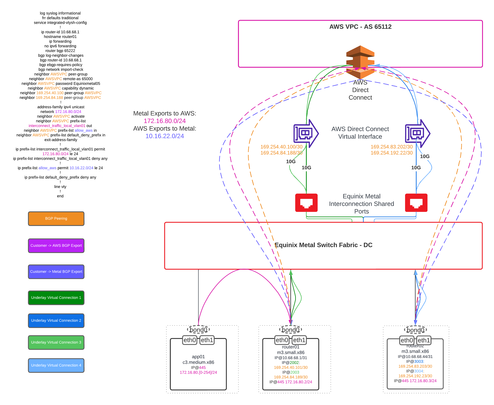
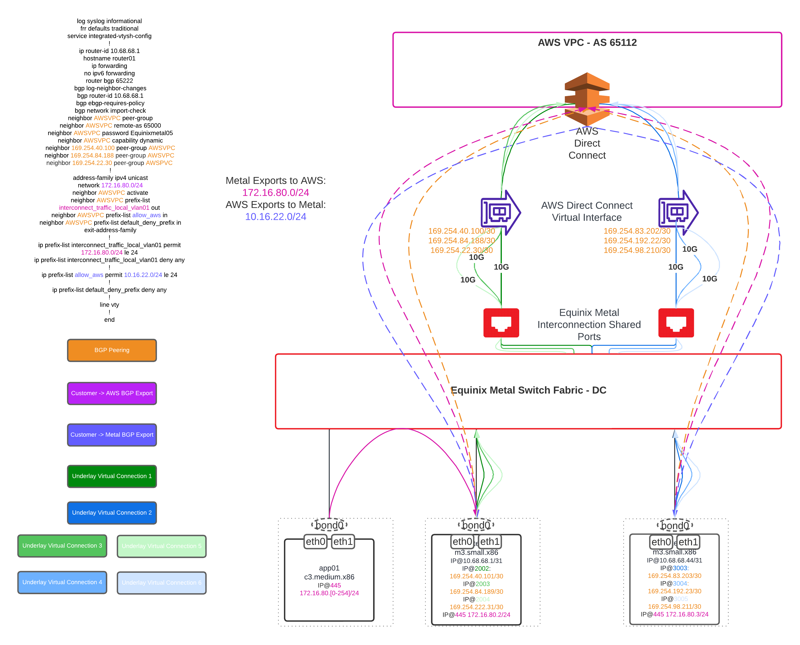

# Hyperscaler Interconnection Considerations for Equinix Metal

This document is intended to be a living best practices document for working with Hyperscaler focused Interconnection in the context of an Equinix Metal deployment. 

This document itself is authoritative for nothing, and defers to other, especially official documentation when conflicting or confusing information is presented. This document is also not intended to be prescriptive. There are too many kinds of workloads deployed in too many ways on Metal that need Interconnection to Hyperscalers to provide one-size fits all designs. Rather this is intended to be a shortlist of the "must checkbox" considerations when thinking about deploying Interconnection prescriptive workloads on Equinix Metal. 

All pricing is purely speculative or example and treated as highly suspicious until confirmed and is included primarily to assist readers with begining to build their own models to reflect their own needs.

## Start with Metal Internet First

The internet access that comes with an Equinix Metal instance is first class, and because of the centrality of connectivity in Equinix sites, network performance of Metal's internet to the Hyperscalers is often "good enough" via similar network paths as private Interconnection. 

Each Hyperscaler has their own IPSec Interconnection endpoint, which can be terminated directly onto a Metal instance or function hosted on a Metal instance.

These VPN endpoints provide similar network functionality as the private interconnection options, such as VPC integration and route / traffic manipulation.

### Backend Transfer

[Don't forget about it](https://deploy.equinix.com/developers/docs/metal/networking/backend-transfer/), it's useful for all kinds of things.

### Commercials of connectivity options

For workloads that are highly bursty, like an hourly ETL that pushes 12Gbps in aggregate for 5 seconds, may better align with pushing that via Metal's included internet than a billed by the hour 10Gbps virtual connection. You can push 21.9GB of egress over Internet to GCP before it would have been more economical to provision an hourly 10GB virtual connection, where at 22.1GB of egress, it would have been better sent over a an hourly virtual connection.

- Metal's [per GB egress charge starts at $0.05](https://deploy.equinix.com/product/global-network/)
- A Metal billed [10Gbps virtual connection is $1.00](https://deploy.equinix.com/fabric/pricing/) per hour
  - Measured by MRC, this is slightly more expensive than a virtual connection between Colocation Fabric ports and Hyperscalers
	- Metal billed VC's are billed by the hour and hence have a slightly higher hourly rate comparatively
- GCP charges [$0.10](https://cloud.google.com/network-connectivity/docs/interconnect/pricing) an hour for a 10Gbps VLAN attachment
- GCP, AWS and Azure* charge per GB egress over Interconnect, Metal does not
	- This means 2GB of data pushed from Metal to GCP over interconnect will be covered by the cost of the Fabric virtual connection and the GCP VLAN attachment
	- 2GB of data pushed from GCP to Metal over Fabric virtual connection will incur an additional [$0.04](https://cloud.google.com/network-connectivity/docs/interconnect/pricing) charge from GCP
		- This transfer over the [public internet would have cost $0.11](https://cloud.google.com/vpc/network-pricing#general), a difference of $0.07 per GB
			- The cost efficiency point is than different for GCP egress to Metal, a 10Gbps Fabric virtual connection pays for itself in ~15GB of transfer when moving data out of GCP.
	- *[Azure has a concept of local circuits](https://azure.microsoft.com/en-us/pricing/details/expressroute/?ef_id=_k_EAIaIQobChMI4erur7ul_wIVOimtBh1N1wHbEAAYASAAEgImbPD_BwE_k_&OCID=AIDcmm5edswduu_SEM__k_EAIaIQobChMI4erur7ul_wIVOimtBh1N1wHbEAAYASAAEgImbPD_BwE_k_&gad=1&gclid=EAIaIQobChMI4erur7ul_wIVOimtBh1N1wHbEAAYASAAEgImbPD_BwE) which expose a path for no egrees free transfer.
			

The per hour rates of the Equinix Metal Billed Virtual Connections are quite effective when thought of in terms of total transfer over the hour window they can exist. A 10GB virtual connection can push ~4400GB of traffic in an hour's lifespan, enough to drastrically change the cost calculations of certain workload analysis models.

### Trombone through colocation instead

For established Equinix customers who may already have interconnection with their Hyperscaler partners provisioned to Fabric ports attached to their Colocation environment, the easiest way to Interconnect Metal with a Hyperscale resource may be to do so via tromboning traffic through that existing colocated infrastructure by connecting Metal to your Colo as a sort of virtual cage extension, allowing the Metal deployment the same network access as a colocated deployment.

While there are very clear reasons to Interconnect Metal directly to a Hyperscaler, it might not be the right choice every time, and connecting via the Colocated Interconnect may have advantages:

- Existing network infrastructure can support the Metal traffic
	- Firewalls, IDS / IPS, Monitoring on the Colocation side
	- Transit Gateways, VPC-Peerings etc on the Hyperscaler side 
- Existing logic doesn't have to be re-implemented
	- Network mappings between Hyperscale-VPC and Customer Networks may be complicated 
- Change control doesn't have to be re-negotiated across domains
	- Just bump out Metal on the network once.
- Cost, if you were going to Interconnect Metal and the Colocation footprint in the first place...
- You may be forced to by limitations
	- Metal can only Interconnect with Metro-local Hyperscaller On-ramps for example
		- To connect Metal in Ashburn to us-west1, a loop through Network Edge or Fabric ports will be required
		

## MTU - MSS

[Maximum Transmission Unit](https://en.wikipedia.org/wiki/Maximum_transmission_unit) is a notorious gremlin in interconnection with highly abstracted or virtualized (cloud) networks. MTU can also be highly variable to changes inside or between services providers, for example when a hyperscaler performs a maintenance and temporarily double encapsulates a network, temporarily changing observed normals. 

- Equinix Metal honors a customer [VLAN MTU up to 9000](https://deploy.equinix.com/developers/docs/metal/layer2-networking/vlans/)
- Equinix Fabric honors a customer MTU [up to 9100](https://docs.equinix.com/en-us/Content/Interconnection/Fabric/ports/Fabric-port-details.htm) depending on the implementation

Equinix Metal and Equinix Fabric will get you to the Z-side (the Hyperscaler's door) honoring MTU 9000. From there, best practices details can very so much depending on the Hyperscaler, the onramp, what was the available capacity and design at the time. The most important take away is to test and observe MTU normals ***before*** going into production for every link where saturation is a concern, and monitor for packet fragmentation or loss on either end.

It's also important to note that MTU settings and best practices will be different between Fabric virtual connections, and Equinix Metal Dedicated Connections or AWS Direct Connect that goes directly into a customers physical ports. Put AWS speak for clarity, there is a distinction between ["Dedicated" and "Hosted" Connections](https://docs.aws.amazon.com/directconnect/latest/UserGuide/WorkingWithConnections.html), each path may have their own substantially different MTU normals.

In particular, MTU 

- AWS MTU Documentation
	- [Dedicated vs Hosted](https://docs.aws.amazon.com/directconnect/latest/UserGuide/WorkingWithConnections.html)
	- [Direct Connect Virtual Interface MTU](https://docs.aws.amazon.com/directconnect/latest/UserGuide/set-jumbo-frames-vif.html)
	- [Transit Gateway MTU](https://docs.aws.amazon.com/vpc/latest/tgw/transit-gateway-quotas.html)
	- [EC2 Instance Interface MTU](https://docs.aws.amazon.com/AWSEC2/latest/UserGuide/network_mtu.html)
	- [Unofficial AWS Transit Gateway sizing](https://github.com/awsdocs/aws-transit-gateway-guide/blob/master/doc_source/transit-gateway-quotas.md)
- GCP MTU Documentation
	- [Partner Interconnect MTU](https://cloud.google.com/network-connectivity/docs/interconnect/how-to/partner/modifying-vlans#modify-description-mtu)
	- [Dedicated Interconnect MTU](https://cloud.google.com/network-connectivity/docs/interconnect/how-to/dedicated/modifying-vlan-attachments#modify-description-capacity-mtu)
	- [VPC MTU](https://cloud.google.com/vpc/docs/mtu)
- Azure MTU Documentation
	- [General Azure MTU documentation](https://learn.microsoft.com/en-us/azure/virtual-network/virtual-network-tcpip-performance-tuning)

### Path MTU Discovery

[Path MTU discovery](https://en.wikipedia.org/wiki/Path_MTU_Discovery) varies depending on ecosystem, as in MTU discovery in [Linux](https://docs.kernel.org/networking/ip-sysctl.html) is different from a Network Function Appliance is different from a Windows host is different from a [cloud platform](https://blog.cloudflare.com/path-mtu-discovery-in-practice/). If your ecosystem has a documented path for "per path MTU discovery", follow that path. For most ecosystems, MTU discovery is dependent on ICMP, and so enabling ICMP between moving parts of the interconnection is important.

## BFD

[Azure](https://learn.microsoft.com/en-us/azure/expressroute/expressroute-bfd), [AWS](https://repost.aws/knowledge-center/enable-bfd-direct-connect) and [GCP](https://cloud.google.com/network-connectivity/docs/router/concepts/bfd) all support optional but simple BFD settings.

It is important to note, as hinted at [*here*](https://repost.aws/knowledge-center/bfd-failover-direct-connect), BFD timers dance with other BGP timers to determine the timeline characteristics of a failure, restart or reconvergence. There is no "just drop BFD timers and HA is solved" setting.

It is also important to note, that Equinix Metal's [BGP functionality](https://deploy.equinix.com/developers/docs/metal/bgp/bgp-on-equinix-metal/), both on it's Layer-3 side, as well as upcoming [Layer-2 VRF](https://github.com/equinix-labs/terraform-equinix-metal-vrf) side, do *not* support BFD, and operators must rely on other timers.

### BGP Timers

Some surface level detail regarding the Hyperscaler's settings around BGP timers can be found with sleuthing and provide quick guidance on building a failure scenario timeline:

- [AWS BGP Quotas and Timers](https://github.com/awsdocs/aws-direct-connect-user-guide/blob/master/doc_source/limits.md)
- [GCP BGP settings and timers](https://cloud.google.com/network-connectivity/docs/router/how-to/managing-bgp-timers)

## ECMP for scaling performance and achieving high availbility

[Equal Cost Multipath (ECMP)](https://en.wikipedia.org/wiki/Equal-cost_multi-path_routing) is a simple but powerful routing strategy that balances load and availability across available links between two (or more) BGP speaking routers. Note ECMP is also referenced sometimes by other names such as "BGP Multipathing".

While each Hyperscaler imposes some of their own HA /scaling suggestions with Dedicated Interconnection, [Azure](https://learn.microsoft.com/en-us/azure/expressroute/expressroute-faqs#how-i-do-implement-redundancy-on-microsoft-peering)([1](https://learn.microsoft.com/en-us/azure/expressroute/designing-for-disaster-recovery-with-expressroute-privatepeering#small-to-medium-on-premises-network-considerations)), [GCP](https://cloud.google.com/network-connectivity/docs/interconnect/concepts/partner-overview)[1](https://cloud.google.com/network-connectivity/docs/interconnect/concepts/best-practices#capacity) and AWS each identify ECMP as the primary mechanism for load balancing across multiple links for both performance and redundancy.

## ECMP Visualized

The below diagrams highlight a customers potential deployment journey from an initial interconnection of a pair of redundant virtual connections going between Metal and AWS, and the Day-2 and Day-N tasks of adding additional capacity to the interconnection.

In the first diagram, we can see a redundant pair of "Metal Billed" (or also called a_side) virtual connections connecting AWS to Metal via Fabric:

In this deployment, a pair of Metal instances acting as router01/02 are running FRR, with an example FRR configuration pasted to the left hand side of the diagram, those routers act as gateways for a hypothetical application cluster hosted in Metal. If the owner of this environment needed to add additional capacity into the environment, they could do this by provisioning another pair of redundant virtual connections, and adding the new neighbor information to the FRR configuration to add additional paths to FRR and hence the router instance.

And additional capacity can be easily added again afterwards.

## Scaling Capacity

It should be noted that capacity managed by ECMP / BGP Multipathing aligns with the "active/active" model of scaling, where redundancy must be calculated into the design. 

When a redundant virtual circut is provisioned, the platform ensures that those virtual connections are placed on non-overlapping hardware, providing what is known as maintenance diversity, where no single outage should impact both paths at the same time. If there are only two paths of interconnection between Metal and AWS, then it is possible than with 8x virtual connections provisioned, that up to half of those could potentially be lost at a time. The remaining capacity must be able to support the platform for the duration of the outage.

### AWS ECMP specifics
While shaping tactics like prefix advertising manipulation will work well for all three hyperscalers, AWS in particular documents nuances and additional relevant BGP comunity strings [here](https://docs.aws.amazon.com/directconnect/latest/UserGuide/routing-and-bgp.html), which is further referenced in this blog by the [AWS team](https://aws.amazon.com/blogs/networking-and-content-delivery/creating-active-passive-bgp-connections-over-aws-direct-connect/)

### Azure ECMP specifics

- [Azure ExpressRoute Routing requirements](https://learn.microsoft.com/en-us/azure/expressroute/expressroute-routing)
- [Azure Optimize Routing](https://learn.microsoft.com/en-us/azure/expressroute/expressroute-optimize-routing)
- [Azure HA with Expressroute](https://learn.microsoft.com/en-us/azure/expressroute/designing-for-high-availability-with-expressroute)

### GCP ECMP specifics

- [GCP specifically calls out a preference](https://cloud.google.com/network-connectivity/docs/interconnect/concepts/best-practices) for [flow based](https://www.rfc-editor.org/rfc/rfc2992) hashing [with ECMP](https://www.noction.com/blog/equal-cost-multipath-ecmp)

GCP also [highlights a natural preference for keeping individual swim-lanes](https://cloud.google.com/network-connectivity/docs/interconnect/how-to/dedicated/configuring-onprem-routers) of Interconnect from cross-populating BGP announcements between routers on each side.

That is to say, given `gcp_cloud_router_A` and `gcp_cloud_router_B` with `metal_router_A` and `metal_router_B`, to only establish BGP peerings between `gcp_cloud_router_A` + `metal_router_A` and **NOT** the mesh of allowing `gcp_cloud_router_A` to create a mesh with `metal_router_B` 	

## Encryption

There is no network encryption as a feature in the Equinix Metal platform. Any encryption between to points over a network in Equinix Metal must be encrypted by the points at the end of the communication themselves. Put another way, there is no IPSec or MACSec as a Service with Equinix Metal, each device in Equinix Metal must orchestrate its own network encryption.

Equinix Interconnection with Equinix Metal does not ride "public" networks, it is still carried by multi-tenant private networks, and should be encrypted when being put onto the wire.

Each of the hyperscalers provides an endpoint to tie together VPN encryption over Interconnect:

- [Azure](https://learn.microsoft.com/en-us/azure/virtual-wan/vpn-over-expressroute) [1](https://learn.microsoft.com/en-us/azure/vpn-gateway/site-to-site-vpn-private-peering)
- [GCP](https://cloud.google.com/network-connectivity/docs/interconnect/concepts/ha-vpn-interconnect)
- [AWS](https://repost.aws/knowledge-center/create-vpn-direct-connect)

## Monitoring

While the Equinix Fabric can provide some [statistics](https://developer.equinix.com/dev-docs/fabric/api-reference/fabric-v4-apis#get-connection-statistics) regarding virtual connections, it should be understood that monitoring of Interconnection is primarily a BYO based effort. 

When monitoring Equinix Metal Layer-2 networks like VLANs or Interconnection, it is important to remember that attributes that are common for a physical network, may not be available to a virtual or abstracted network such as Metal's, Fabric's or a Hyperscalers.

An easy example is link state. In the path betwen an Equinix Metal instance and a Hyperscaler, only a Metal instance's physical NICs would likely report a link failure in response to an outage between the Metal instance and it's ToR. Any other outage or cut in the path would be unlikely to update any customer visible link state, instead likely creating a silent blackhole in the middle of the path. 

For this reason, Equinix Metal heavily suggest the use of path, flow or endpoint based monitoring rather than 
"configured state" monitoring. Instead of monitoring if a port is up, monitor if a endpoint is suddenly no longer reachable via a path or receiving traffic.

### Hyperscaler side monitoring

It is likely that the Hyperscaler provides some monitoring available through their side of the Interconnection. For example GCP concentrates these statistics in it's [Network Topology view](https://cloud.google.com/network-connectivity/docs/interconnect/concepts/overview#visualize_and_monitor_interconnect_connections_and_vlan_attachments)

## On-ramps

It is important to note that not every Hyperscaler-region is available out of every Equinix Metro. In fact only the Hyperscaler-regions with on-ramps in the local Metro will be available for Interconenction with Metal out of the same Metro. This is partially because of the limitation of Metal billed virtual connections only being able to connect to [A-side in the same Metro](https://deploy.equinix.com/developers/docs/metal/interconnections/metal-billed-fabric-vc/).

Put another way, both AWS `us-east-1` and `us-east;-2 available for Interconnection in Equinix Metal's "Ashburn" metro, however `ap-east-1` will be unavailable for Interconnection.

To connect Metal to a geographically diverse Hyperscaler on-ramp, a loop through a [Colocated Fabric](https://docs.equinix.com/en-us/Content/Interconnection/Fabric/ports/Fabric-port-details.htm) connection or [Network Edge](https://docs.equinix.com/en-us/Content/Interconnection/NE/landing-pages/NE-landing-main.htm) device will be necessary.

## Physical Dedicated Interconnection and Equinix Metal's lack of LACP on Interconnection

Equinix Metal is capable of physically Interconnecting with other networks by hosting a physical cross-connect between Metal and a A-zide location, where that A-side side can essentially be anything that speaks `SMF-LC` with `802.1q`.

Similarly, the Hyperscalers also provide paths for dedicated physical interconnection, and this path can be used to physically interconnect Equinix Metal with a Hyperscaler if needed.

Specific to GCP, GCP is only capable of physically interconnecting with LACP enabled, that is even with a single connection, that connection between GCP and the Z-side **MUST** speak LACP, even just of an LACP bond of 1x port.

Equinix Metal is not [currently](https://metal.canny.io/private-connectivity/p/lacp-for-crossconnects) capable of implementing LACP on Interconnection, including Dedicated Ports. This effectively makes physical interconnection with GCP directly from Metal impossible without special engineering involvement.

## Equinix Metal VRF

Equinix Metal VRF is a feature addition for Equinix Metal being rolled out through various checkpoints through Q2/Q3/Q4 of 2023.

Equinix Metal VRF introduces a "BGP-as-a-Service" feature that is orchestrated and automated via Equinix Metal.

With Equinix Metal VRF, customers can provision a virtual routing function that is abstracted and hosted on each Top of Rack of each Metal instance in the configured customer network. That VRF can be configured to BGP peer with other neighbors inside the same network namespace and apply routing updates to a customer's network automatically.

This allows a customer to configure what is a BGP speaker hosted by the Metal network, inside the Metal network. 

This will be a paid for feature once released.

It is likely that once released, VRF will become the preferred path for BGP speaking with Interconnection and Metal, and that instead of configuring a BGP speaker to run on a Metal instance itself to connect to a Hyperscale cloud.

It should be noted that Equinix Metal will not have some feature functionality in its first release. For example it is known that it will be released without BFD. Customers who are looking for a high degree of customization or control granularity will likely still want to bring their own BGP speaking functionality.

## Testing and rapid, low overhead on-demand provisioning

It is the authors belief the single most important feature to consider with Equinix Metal and interconnection is the ability to mock and test entire solutions quickly and cheaply.

Considering an entire Interconnection environment can be stood up in ~20 minutes with Terraform for $4.45, Interconnection with Metal is unique in that it can be tested, over and over, rapidly and cheaply, which makes a traditionally very difficult to test deployment now exceedingly easy to test.

Customers should test all elements of their deployment before and after proceeding to production.

### Example Metal <-> AWS A-side Terraform

An example terraform is included that can be used to quickly spin up an example lab environment with which to test interconnection. The terraform is far from complete and is intended to be used primarily as reference.
