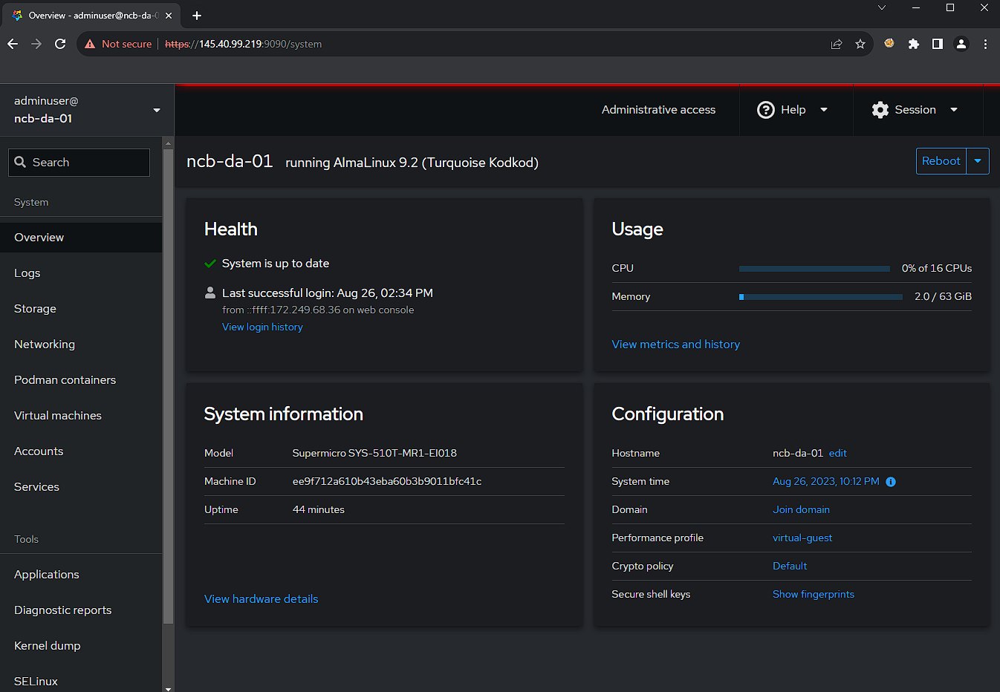

# "No Code" + "Safe First" + "Bastion" + "Virtual Appliance Host" for Equinix Metal

Or **NCSFBVAHfEM** for short... Just kiding, shorten it to *no_code_bastion* or `ncb` for really short.

<p float="middle">
  
</p>

When evaluating or working with [Equinix Metal](https://deploy.equinix.com/product/bare-metal/), operators often want a "fastest path to running an application or device inside of the Equinix", where the bootstrap curve of the Equinix Metal is such that often the hardest part is figuring out where to start.

<p float="middle">
  
</p>

*no_code_bastion* aims to minimize the amount of toil needed to quickly and safely establish a familiar operational beachead inside of Equinix Metal for operators looking to get going quickly and safely-ish (or atleast, more so than without this resource) with their project.

By "Ctrl + C" & "Ctrl + V"'ing this [cloud-init](cloud_inits/el9_no_code_safety_first_appliance_host.yaml) into the [Userdata](https://deploy.equinix.com/developers/docs/metal/server-metadata/user-data/) field when provisioning an [Equinix Metal instance](https://deploy.equinix.com/product/bare-metal/servers/), an Operator should be returned a useable, working `no_code_bastion` instance, ready for brush clearing.

Please note, as with anything in this reposistory, this resource is not supported by **ANYONE**. It is meant solely and exclusively as a reference resource. That being said, as of summer 2023, the owner is still looking to improve this resource and fix any quick wins. If anything about this perks you interest, get in contact with your [Equinix Metal sales team](https://deploy.equinix.com/get-started/).

**Quick Bullet Points of Toils Solved:**

- [Management UI](https://access.redhat.com/documentation/en-us/red_hat_enterprise_linux/9/html/managing_systems_using_the_rhel_9_web_console/index) ([Cockpit](https://cockpit-project.org/) via self-signed HTTPS over [Metal Internet](https://deploy.equinix.com/developers/docs/metal/networking/ip-addresses/#public-ipv4-subnet))
- VM hosting via [libvirt](https://libvirt.org/) (accesible in [Cockpit](https://access.redhat.com/documentation/en-us/red_hat_enterprise_linux/9/html/managing_systems_using_the_rhel_9_web_console/managing-virtual-machines-in-the-web-console_system-management-using-the-rhel-9-web-console))
- Container hosting via [podman](https://podman.io/) (accesible in [Cockpit](https://github.com/cockpit-project/cockpit-podman))
- Automatic Updates configured via [dnf-automatic](https://dnf.readthedocs.io/en/latest/automatic.html)
- Basic securitization (`root` -> `adminuser`, firewall up, user-lockout etc)
- Mounts largest non-HDD free disk to `/mnt/util/`
  - Adds it as storage volume to `libvirt`
- Network
    - Replaces stock Metal networking with `eth0/1` -> `bond0` -> `bridge` -> `VLAN` model allowing guests access to the native VLAN (carrying EM's [Layer-3 network](https://deploy.equinix.com/developers/docs/metal/networking/ip-addresses/)) + [tagged VLAN](https://deploy.equinix.com/developers/docs/metal/layer2-networking/overview/)s while persisting the desired [Equinix Metal LACP bonding](https://deploy.equinix.com/developers/docs/metal/networking/server-level-networking/#your-servers-lacp-bonding) configuration.
        - This allows the instance and it's guests to acces [Interconnection](https://deploy.equinix.com/developers/docs/metal/interconnections/introduction/)
    - DHCP + NAT Internet in guest network via relatively stock [libvirt](https://wiki.libvirt.org/VirtualNetworking.html)
    - Inside VLAN Layer-3 configuration dynamic based on hostname, e.g a host launched as `bn-am-55` will use `55` as it's inside IP for all networks (e.g `172.16.100.55`), a host launched with `bn-am-33` would then be assigned `33` (e.g `172.16.100.33`), and they would be able to ping each other inside VLAN `3880` when assigned that VLAN from the Metal platform.
    - Forward DNS in guest network (via hijack of libvirt's dnsmasq with Metal's DNS as next forward hop)
    - Reverse DNS in guest network (via hijack of libvirt's dnsmasq)
        ```
        dig -x 192.168.122.55 @192.168.122.1
        ...
        ;; ANSWER SECTION:
        55.122.168.192.in-addr.arpa. 0  IN      PTR     host-55.inside.em.com.
        ```
        - Note the generic `host-55.inside.em.com.`
    - Automatic inclusion in [EM SA Network Schema networks](https://github.com/dlotterman/metal_code_snippets/tree/main/virtual_appliance_host/no_code_with_guardrails#em-sa-network-schema), simply apply VLANs from the Metal UI / CLI in [Hybrid Bonded](https://deploy.equinix.com/developers/docs/metal/layer2-networking/hybrid-bonded-mode/) mode
- HTTP endpoint via NGINX
    - Public Internet exposed HTTP endpoint (port `80` on Metal Instance's [Public IP](https://deploy.equinix.com/developers/docs/metal/networking/ip-addresses/#public-ipv4-subnet))
    - Private ([Backend Transfer](https://deploy.equinix.com/developers/docs/metal/networking/backend-transfer/) + VLAN only, port `81`) exposed HTTP endpoint (not open to internet)
- Should work with broadly with [Equinix Metal hardware](https://deploy.equinix.com/developers/docs/metal/hardware/standard-servers/) (including [4x port boxes](https://deploy.equinix.com/product/servers/n3-xlarge/) and the [s3.xlarge](https://deploy.equinix.com/product/servers/s3-xlarge/)

## Documentation

1. [TLDR on how this works](docs/tldr.md)
2. [Provisioning](docs/provisioning.md)
  - [Privisioning video](https://equinixinc-my.sharepoint.com/:v:/g/personal/dlotterman_equinix_com/EWDXuOfNxCNDoZGRYgbz8JEBnQkky7fWD1Th4Eg5O41WLA?nav=eyJyZWZlcnJhbEluZm8iOnsicmVmZXJyYWxBcHAiOiJPbmVEcml2ZUZvckJ1c2luZXNzIiwicmVmZXJyYWxBcHBQbGF0Zm9ybSI6IldlYiIsInJlZmVycmFsTW9kZSI6InZpZXciLCJyZWZlcnJhbFZpZXciOiJNeUZpbGVzTGlua0RpcmVjdCJ9fQ&e=aYpY6H)
3. [Video adding a VM](https://equinixinc-my.sharepoint.com/:v:/g/personal/dlotterman_equinix_com/Ectv795zYmZHp4nE7-ODOHgBR6GN8E2KDuwWCUwJ8BDsww?nav=eyJyZWZlcnJhbEluZm8iOnsicmVmZXJyYWxBcHAiOiJPbmVEcml2ZUZvckJ1c2luZXNzIiwicmVmZXJyYWxBcHBQbGF0Zm9ybSI6IldlYiIsInJlZmVycmFsTW9kZSI6InZpZXciLCJyZWZlcnJhbFZpZXciOiJNeUZpbGVzTGlua0RpcmVjdCJ9fQ&e=G8TKEf)
4. [Video adding a new Metal VLAN network](https://equinixinc-my.sharepoint.com/:v:/g/personal/dlotterman_equinix_com/Eb0FZxWqfzpKhuYssc7XjeABtbEu3LAOHLODJ65Iiql9mQ?nav=eyJyZWZlcnJhbEluZm8iOnsicmVmZXJyYWxBcHAiOiJPbmVEcml2ZUZvckJ1c2luZXNzIiwicmVmZXJyYWxBcHBQbGF0Zm9ybSI6IldlYiIsInJlZmVycmFsTW9kZSI6InZpZXciLCJyZWZlcnJhbFZpZXciOiJNeUZpbGVzTGlua0RpcmVjdCJ9fQ&e=m8Dvrv)

The video links are links to Equinix's 0365 Sharepoint (sharepoint.com), and they are just hosted MP4's. The public share may expire from time to time, my apologies, corporate policy.

## EM SA Network Schema:
| Role            | VLAN      | Default Layer-3         |
|-----------------|-----------|-------------------------|
| `mgmt_a`        | `3880`    | `172.16.100.0/24`       |
| `mgmt_b`        | `3780`    | `192.168.101.0/24`      |
| `storage_a`     | `3870`    | `172.16.253.0/24`       |
| `storage_b`     | `3770`    | `192.168.252.0/24`      |
| `local_a`       | `3860`    | `172.16.251.0/24`       |
| `local_b`       | `3760`    | `192.168.250.0/24`      |
| `inter_a`       | `3850`    | `172.16.249.0/24`       |
| `inter_b`       | `3750`    | `192.168.248.0/24`      |
| `libvirt/guest` | `4`       | `DHCP 192.168.122.0/24` |
