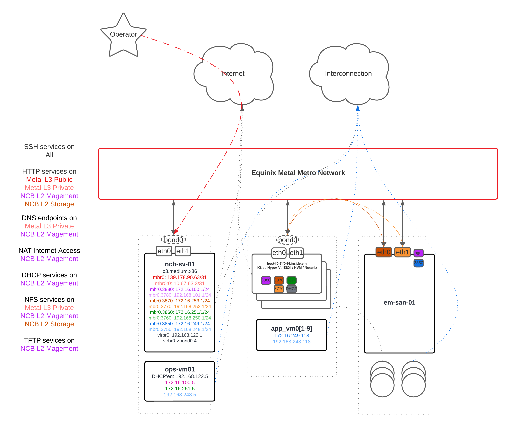

# **NCB**: Node Code Bastion for Equinix Metal

<p float="middle">
  
</p>

`NCB` is a single, "copy+paste'able" [cloud-init](https://cloudinit.readthedocs.io/en/latest/index.html) file, that used when [provisioning](https://deploy.equinix.com/developers/docs/metal/server-metadata/user-data/) a [Equinix Metal instance](https://deploy.equinix.com/developers/docs/metal/hardware/standard-servers/) with [Alma 9](https://deploy.equinix.com/developers/docs/metal/operating-systems/supported/#almalinux) or [Rocky 9](https://deploy.equinix.com/developers/docs/metal/operating-systems/supported/#rocky-linux), will turn that instance into a **"swiss army"** bastion box.


<p float="middle">
  
</p>

It can be used to quickly establish an operational footprint inside of an Equinix Metal [project](https://deploy.equinix.com/developers/docs/metal/projects/managing-a-project/).

A quick highlight of `NCB`'s utility functions and toil reducers:

- Secure inside <-> outside management access to an Equinix Metal project
- Network and utility services such as DHCP and NAT
- PXE Toolchain for BYO-OS
- File hosting via HTTP and NFS
- Automatic Network Setup for [Hybrid Bonded Mode](https://deploy.equinix.com/developers/docs/metal/layer2-networking/hybrid-bonded-mode/) including [VLANs](https://github.com/dlotterman/metal_code_snippets/blob/main/documentation_stage/em_sa_network_schema.md)
	- Quickly test inside Metal network connectivity, just provision two `NCB` hosts
- Container and VM hosting
- Optional: VyOS ISO builder
- Optional: Kubernetes via [k3s](https://k3s.io/)

## How to use

Just copy (`Ctrl / Cmd + C`) the content of [this cloud-init](cloud_inits/el9_no_code_safety_first_appliance_host.mime) and Paste (`Ctrl / Cmd + P`) the contents into the [Userdata form](https://deploy.equinix.com/developers/docs/metal/server-metadata/user-data/#usage) when provisioning an Equinix Metal instance with `alma_9` or `rocky_9`. Thats it.

Please see videos below for extra context.

***For best experience, use the `.mime` encoded file***

This minimzes browser / user input (copy+paste) inconsistencies. Simply copy the [text from the mime encoded file](https://raw.githubusercontent.com/dlotterman/metal_code_snippets/main/virtual_appliance_host/no_code_with_guardrails/cloud_inits/el9_no_code_safety_first_appliance_host.mime) and paste it into the user data section of the Metal instance provisoning page.

The `mime` encoded file is simply the output of `cloud-init devel make-mime` run on the `yaml` file in the same directory.

After the instance is "provisioned" in Equinix Metal, it may take up to 4-10 minutes for the automation to complete. You will know it's complete when the [Cockpit](https://cockpit-project.org/) interface is available on the instances Public IP on port `9090`.

###  Login Credentials / Authentication

Outside in access via `root` is disabled, as in it is denied in the config of `sshd` and `cockpit`.

* To `ssh` in, use the following credentials:
  - **Username:**`adminuser`
  - Use your [Metal SSH Key](https://deploy.equinix.com/developers/docs/metal/identity-access-management/ssh-keys/)
* To `sudo`, or login via the Cockpit UI:
  - **Username:** `adminuser`
  - Password: is the `UUID` of the Metal instance itself. You can copy it from the instances details in the WebUI or [metadata](https://deploy.equinix.com/developers/docs/metal/server-metadata/metadata/).
    - It is worth noting, the `UUID` of an instance is only discernable from the inside of Metal, which presumes authentication by at least two factors if required.


## Support

Please note, as with anything in this reposistory, this resource is not supported by **ANYONE**. It is meant solely and exclusively as a reference resource and convenience tool. That being said, as of summer 2024, the owner is still looking to improve this resource and fix any quick wins. If anything about this perks you interest, get in contact with your [Equinix Metal sales team](https://deploy.equinix.com/get-started/).

## **Quick Bullet Points of Toils Solved:**

- Moves `root` user to -> `adminuser`
    - Use of root for outside access is restricted, access outside in with user `adminuser`
    - `adminuser`'s password should be the `UUID` of the instance.
	- Applies lockout / brute force restrictions
- [Management UI](https://access.redhat.com/documentation/en-us/red_hat_enterprise_linux/9/html/managing_systems_using_the_rhel_9_web_console/index) ([Cockpit](https://cockpit-project.org/) via self-signed HTTPS over [Metal Internet](https://deploy.equinix.com/developers/docs/metal/networking/ip-addresses/#public-ipv4-subnet))
- VM hosting via [libvirt](https://libvirt.org/) (accesible in [Cockpit](https://access.redhat.com/documentation/en-us/red_hat_enterprise_linux/9/html/managing_systems_using_the_rhel_9_web_console/managing-virtual-machines-in-the-web-console_system-management-using-the-rhel-9-web-console))
- Container hosting via [podman](https://podman.io/) (accesible in [Cockpit](https://github.com/cockpit-project/cockpit-podman))
- Automatic Updates via [dnf-automatic](https://dnf.readthedocs.io/en/latest/automatic.html)
- Turns up firewall and limits access
- Mounts largest non-HDD free disk to `/mnt/util/`
  - Adds it as storage volume to `libvirt`
  - Exposed via private network HTTP (via `nginx` below)
  - Exposed via private network NFS (via `nfs-server`)
- Network
    - Replaces stock Metal networking with `eth0/1` -> `bond0` -> `bridge` -> `VLAN` model allowing guests access to the native VLAN (carrying EM's [Layer-3 network](https://deploy.equinix.com/developers/docs/metal/networking/ip-addresses/)) + [tagged VLAN](https://deploy.equinix.com/developers/docs/metal/layer2-networking/overview/)s while persisting the desired [Equinix Metal LACP bonding](https://deploy.equinix.com/developers/docs/metal/networking/server-level-networking/#your-servers-lacp-bonding) configuration.
        - This allows the instance and it's guests to access [Interconnection](https://deploy.equinix.com/developers/docs/metal/interconnections/introduction/)
		- This allows the instance and it's guests to access [Metal's L3 Networking](https://deploy.equinix.com/developers/docs/metal/networking/ip-addresses/) including [BGP Peering](https://github.com/dlotterman/metal_code_snippets/blob/main/documentation_stage/networking/operators_guide_metal_bgp.md#how-to-bgp-peer-through-metal-hosted-vnfs-virtual-appliances-or-just-vms)
    + NAT'ed Internet for `mgmt_a` network
    - DHCP for mgmt_a network via hostname ending in `-01`, for example `ncb-sv-01`
    - Inside VLAN Layer-3 configuration dynamic based on hostname, e.g a host launched as `ncb-am-55` will use `55` as it's inside IP for all networks (e.g `172.16.100.55`), a host launched with `ncb-am-33` would then be assigned `33` (e.g `172.16.100.33`), and they would be able to ping each other inside VLAN `3880` when assigned that VLAN from the Metal platform.
    - Forward DNS in management networks
    - Reverse DNS in management networks
        ```
		[adminuser@ncb-sv-21 ~]$ dig -x 172.16.100.5 @172.16.100.21
		... snip ...
		5.100.16.172.in-addr.arpa. 0    IN      PTR     host-5.mgmta.gtst.local.
		... snip ...
        ```
        - Note the generic `host-5.mgmtb.gtst.local.`
    - Automatic inclusion in [EM SA Network Schema networks](https://github.com/dlotterman/metal_code_snippets/tree/main/virtual_appliance_host/no_code_with_guardrails#em-sa-network-schema), simply apply VLANs from the Metal UI / CLI in [Hybrid Bonded](https://deploy.equinix.com/developers/docs/metal/layer2-networking/hybrid-bonded-mode/) mode
- HTTP endpoint via NGINX
    - Public Internet exposed HTTP endpoint (port `90` on Metal Instance's [Public IP](https://deploy.equinix.com/developers/docs/metal/networking/ip-addresses/#public-ipv4-subnet))
    - Private ([Backend Transfer](https://deploy.equinix.com/developers/docs/metal/networking/backend-transfer/) + VLAN only, port `81`) exposed HTTP endpoint (not open to internet)
- Forward HTTP proxy via NGINX
    - Allows servers on private networks to use `ncb` as a simple HTTP proxy on port 83
    - This allows for easy "no public internet" installs for things that can HTTP proxy on the private management network, like [Harvester](https://docs.harvesterhci.io/v1.1/install/harvester-configuration/#example-9) or [OpenShift](https://docs.openshift.com/container-platform/4.12/networking/enable-cluster-wide-proxy.html).
- NFS / NAS via linux
    - Exposes largest non-HDD drive via NFS to private networks, including Metal's Backend Transfer network
- TFTP server via dnsmasq in `mgmt_a` network via hostname ending in `-01`, for example `ncb-sv-01`
    - Enables quick paths for `DHCP` + `PXE` + `TFTP` + `HTTP/NFS` BYO-OS install paths
- Should work with broadly with [Equinix Metal hardware](https://deploy.equinix.com/developers/docs/metal/hardware/standard-servers/) (including [4x port boxes](https://deploy.equinix.com/product/servers/n3-xlarge/) and the [s3.xlarge](https://deploy.equinix.com/product/servers/s3-xlarge/)

Optionally:
- Installs kubernetes by adding the tag `ncb_k3s` to instance via the Metal UI or API
- Builds VyOS ISO by adding the tag `ncb_vyos` to instance via the Metl UI or API

## Documentation

- [TLDR on how this works](docs/tldr.md)
- [Provisioning](docs/provisioning.md)
    1. [Privisioning video](https://equinixinc-my.sharepoint.com/:v:/g/personal/dlotterman_equinix_com/EWDXuOfNxCNDoZGRYgbz8JEBnQkky7fWD1Th4Eg5O41WLA?nav=eyJyZWZlcnJhbEluZm8iOnsicmVmZXJyYWxBcHAiOiJPbmVEcml2ZUZvckJ1c2luZXNzIiwicmVmZXJyYWxBcHBQbGF0Zm9ybSI6IldlYiIsInJlZmVycmFsTW9kZSI6InZpZXciLCJyZWZlcnJhbFZpZXciOiJNeUZpbGVzTGlua0RpcmVjdCJ9fQ&e=aYpY6H)
- [Video adding a VM from Cloud install](https://equinixinc-my.sharepoint.com/:v:/g/personal/dlotterman_equinix_com/Ectv795zYmZHp4nE7-ODOHgBR6GN8E2KDuwWCUwJ8BDsww?nav=eyJyZWZlcnJhbEluZm8iOnsicmVmZXJyYWxBcHAiOiJPbmVEcml2ZUZvckJ1c2luZXNzIiwicmVmZXJyYWxBcHBQbGF0Zm9ybSI6IldlYiIsInJlZmVycmFsTW9kZSI6InZpZXciLCJyZWZlcnJhbFZpZXciOiJNeUZpbGVzTGlua0RpcmVjdCJ9fQ&e=G8TKEf)
- [Video adding Windows VM from ISO w/ VLAN](https://equinixinc-my.sharepoint.com/:v:/g/personal/dlotterman_equinix_com/EWZj3Z3qULdIgkaPjOQzfwABOzGsgL3huqt33Na9SprmGg?nav=eyJyZWZlcnJhbEluZm8iOnsicmVmZXJyYWxBcHAiOiJPbmVEcml2ZUZvckJ1c2luZXNzIiwicmVmZXJyYWxBcHBQbGF0Zm9ybSI6IldlYiIsInJlZmVycmFsTW9kZSI6InZpZXciLCJyZWZlcnJhbFZpZXciOiJNeUZpbGVzTGlua0RpcmVjdCJ9fQ&e=BwEkH6)
- [Video adding container with example of `podman pull` to show equivalent of `docker pull`](https://equinixinc-my.sharepoint.com/:v:/g/personal/dlotterman_equinix_com/ERTMEtdsHONAj25OjlxtGdIBF6Tb9Or6_r5OT0AOpJB1qg?nav=eyJyZWZlcnJhbEluZm8iOnsicmVmZXJyYWxBcHAiOiJPbmVEcml2ZUZvckJ1c2luZXNzIiwicmVmZXJyYWxBcHBQbGF0Zm9ybSI6IldlYiIsInJlZmVycmFsTW9kZSI6InZpZXciLCJyZWZlcnJhbFZpZXciOiJNeUZpbGVzTGlua0RpcmVjdCJ9fQ&e=14QHeH)
- [Video adding a new Metal VLAN network](https://equinixinc-my.sharepoint.com/:v:/g/personal/dlotterman_equinix_com/Eb0FZxWqfzpKhuYssc7XjeABtbEu3LAOHLODJ65Iiql9mQ?nav=eyJyZWZlcnJhbEluZm8iOnsicmVmZXJyYWxBcHAiOiJPbmVEcml2ZUZvckJ1c2luZXNzIiwicmVmZXJyYWxBcHBQbGF0Zm9ybSI6IldlYiIsInJlZmVycmFsTW9kZSI6InZpZXciLCJyZWZlcnJhbFZpZXciOiJNeUZpbGVzTGlua0RpcmVjdCJ9fQ&e=m8Dvrv)
- [Security TLDR (WIP)](docs/security_tldr.md)
- [TODO](docs/todo.md)
- [Known Issues](docs/known_issues.md)
- [BYO-OS](docs/byo_os.md)

The video links are links to Equinix's 0365 Sharepoint (sharepoint.com), and they are just hosted MP4's. The public share may expire from time to time, my apologies, corporate policy.

### Tools you will want

- A well setup SSH toolchain including a public SSH key associated with your user in [Equinix Metal](https://deploy.equinix.com/developers/docs/metal/identity-access-management/ssh-keys/)
  - This includes the use of SSH based Interconnection
    - [SOCKS](https://github.com/dlotterman/metal_code_snippets/blob/main/documentation_stage/operator_documentation/bastion_socks_tunnel_guide.md#configuring-ssh-with-socks)
	- With a correctly configured SOCKs proxy, you can navigate *"inside"* or private resources like ESXi interfaces, storage interfaces, or Interconnection attached resources, easily from a single point. It is often easiest to "Dedicate a browser to the function", [Firefox Portable](https://support.mozilla.org/en-US/questions/1286588) makes this easy and supports tunneled DNS.
    - [Local / Remote Port Forwading](https://linuxize.com/post/how-to-setup-ssh-tunneling/)
      - This makes things like RDP'ing to a hosted VM or a "prive network only" Metal instance simple and fast. No fiddling with VPN's, no dangerous exposed ports to the internet. Everything gets encrypted, everything stays private.
- A VNC client
  - The author promotes [TigerVNC](https://github.com/TigerVNC/tigervnc)
    - [VNC over SSH](https://sscf.ucsd.edu/self-help-guides/tutorials/linux/vnc-with-ssh-tunnel)

### Known incompatible hardware
- c2.medium.x86
  - Has problems provisioning alma_9
- t3.small.x86
  - Cannot provision alma_9
- m3.small.x86
  - Some m3.smalls are currently launched with Intel E810 NICs that have an incompatibility with their ToR that block some deployments

### Tag Enabled Extensions

`NCB` can be extended by adding tags to running instances via the [Metal UI or API](https://deploy.equinix.com/developers/docs/metal/server-metadata/device-tagging/).

The reason these are not installed by default is that they likely involve downloading outside, semi-trusted code.

Up to this point, we have only used software packages direct from Enterprise Linux, no outside code has yet been run on the system. To be explicit **Tag Enabled Extensions** will download and run code like the [k3s](https://docs.k3s.io/helm) installer and run them relatively un-trusted. To avoid this, just don't use the **Tag Enabled Extensions**, and everything will still vanilla Enterprise Linux.

Once the instance is provisioned and accessible by `Cockpit`, the following tags will trigger their described behavior:

- `ncb_k3s`: An `NCB` instance tagged with `ncb_k3s` will install a minimal [k3s](https://k3s.io/) install on the `ncb` instance, including [clusterctl (AKA CAPI)](https://cluster-api.sigs.k8s.io/clusterctl/overview.html), and [cert-manager](https://cert-manager.io/)
	- [Docs here](docs/k3s.md)
- `ncb_vyos`: An `NCB` instance tagged with `ncb_vyos` will download the most recent VyOS source from github, and [follow these basic instructions](https://blog.vyos.io/introducing-the-image-build-flavor-system?utm_medium=email&_hsenc=p2ANqtz--cwWxln0yduVs8XGZ0QP_g1DO49i0YblM15ka7g35JEQrFQ3bE7k5OQIDq-zNUFY2b5tsoDIffOLvCxgxEsMITk2acUQ&_hsmi=306480568&utm_content=306480568&utm_source=hs_email#cb5-1) to build and host the VyOS artiftacts for immediate iPXE install.
	- [Docs here](docs/vyos.md)

## EM SA Network Schema:
[Reference link](https://github.com/dlotterman/metal_code_snippets/blob/main/documentation_stage/em_sa_network_schema.md)
| Role            | VLAN      | Default Layer-3         |
|-----------------|-----------|-------------------------|
| `mgmt_a`        | `3880`    | `172.16.100.0/24`       |
| `mgmt_b`        | `3780`    | `192.168.101.0/24`      |
| `storage_a`     | `3870`    | `172.16.253.0/24`       |
| `storage_b`     | `3770`    | `192.168.252.0/24`      |
| `local_a`       | `3860`    | `172.16.251.0/24`       |
| `local_b`       | `3760`    | `192.168.250.0/24`      |
| `inter_a`       | `3850`    | `172.16.249.0/24`       |
| `inter_b`       | `3750`    | `192.168.248.0/24`      |
| `libvirt/guest` | `4`       | `DHCP 192.168.122.0/24` |
